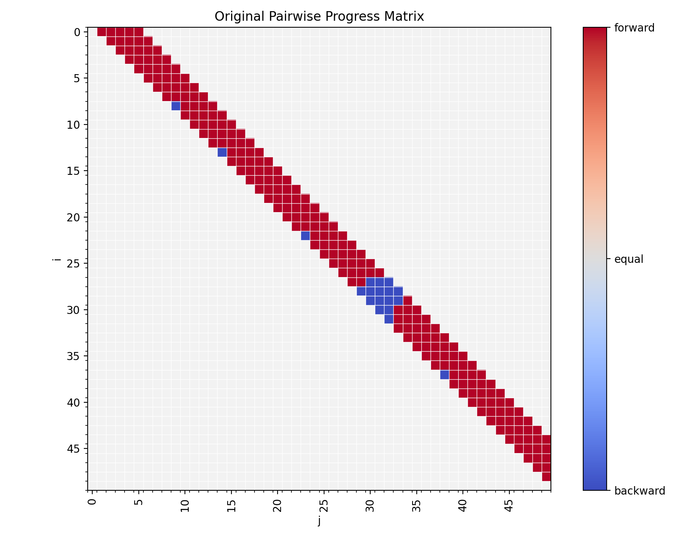
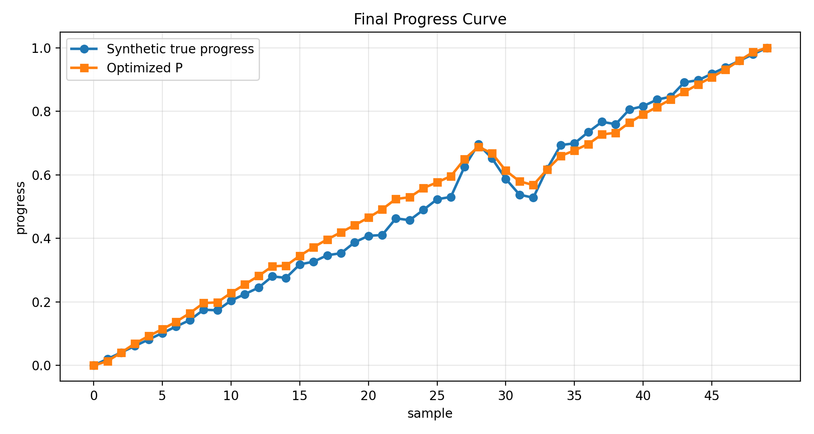

# Graph Optimization for Progress

这个仓库用一个最小可运行示例演示：如何把局部两两比较关系转成一个全局的连续进度值 `P`。脚本先生成一条带有局部波动和回退的合成真实进度曲线，然后只保留相邻窗口内样本之间的前进/后退/相等关系，最后通过优化恢复一条平滑的 progress 曲线。

## 文件说明

- `paril_progress_fixed_m_demo.py`：完整演示脚本，包含数据构造、两两比较矩阵生成、优化目标函数和图像保存。
- `original_comparison_matrix.png`：原始两两 progress 比较矩阵。
- `final_progress_curve.png`：真实 progress 与优化后 `P` 的对比曲线。

## 运行方式

需要 Python 以及以下依赖：

```bash
pip install numpy pandas scipy matplotlib
```

运行脚本：

```bash
python paril_progress_fixed_m_demo.py
```

运行后会在当前目录生成或覆盖：

```text
original_comparison_matrix.png
final_progress_curve.png
```

同时终端会输出优化是否成功、最终目标函数值，以及每个样本点的真实 progress、优化后的 `P` 和相邻差分 `Delta_P_next`。

## 示例设置

脚本中的主要参数如下：

- `N = 50`：样本数量。
- `K = 5`：只比较每个样本之后最多 5 个样本，即只使用局部窗口内的 pairwise 关系。
- `m = 0.1`：pairwise 约束中的固定间隔。如果样本 `j` 比样本 `i` 更靠前，则希望 `P[j] - P[i]` 接近 `0.1`；如果更靠后，则接近 `-0.1`。
- `lambda_s = 1.0`：平滑项权重，抑制 `P` 出现过强的局部弯折。
- `lambda_a = 100.0`：端点锚定权重，约束 `P[0]` 接近 `0`，`P[-1]` 接近 `1`。

合成数据由三部分组成：

- `base_progress`：从 0 到 1 的线性主趋势。
- `local_wave`：若干小幅局部波动，用来模拟短时间内的前进、停滞或轻微回退。
- `large_wave`：样本 26 到 34 附近的一段较大波动，用来制造更明显的非单调区间。

## 优化目标

优化变量是每个样本对应的连续进度值 `P`，取值范围限制在 `[0, 1]`。目标函数包含三项：

```text
pair_loss
+ lambda_s * smooth_loss
+ lambda_a * anchor_loss
```

- `pair_loss`：让优化后的 `P` 尽量符合两两比较结果。比较结果 `r` 取 `1`、`0`、`-1`，分别表示 `j` 相对 `i` 前进、相等、后退。
- `smooth_loss`：惩罚二阶差分，让恢复出来的 progress 曲线更平滑。
- `anchor_loss`：固定整体尺度，避免解整体漂移，使起点接近 0、终点接近 1。

优化使用 `scipy.optimize.minimize` 的 `L-BFGS-B` 方法，并给每个 `P[i]` 设置 `[0, 1]` 边界。

## 图像含义

### 原始两两比较矩阵



这张图展示了样本之间的局部 pairwise progress 判断。横轴是后一个样本 `j`，纵轴是前一个样本 `i`。只有满足 `i < j <= i + K` 的局部窗口会被比较，所以有颜色的格子集中在主对角线右上方附近，其余浅灰色区域表示没有比较数据。

颜色含义：

- 红色 `forward`：`true_progress[j] > true_progress[i]`，表示从 `i` 到 `j` 是前进关系。
- 蓝色 `backward`：`true_progress[j] < true_progress[i]`，表示局部出现回退。
- 中间色 `equal`：两者进度近似相等。
- 浅灰色：该样本对没有被纳入比较。

大部分红色格子说明整体 progress 是向前推进的。少量蓝色格子对应合成曲线中的非单调片段，尤其是样本 28 到 32 附近的蓝色块，表示那里存在明显回退。这些蓝色约束是优化问题需要同时解释的局部冲突信息。

### 最终进度曲线



这张图对比了两条曲线：

- 蓝色圆点 `Synthetic true progress`：脚本构造出来的合成真实进度。
- 橙色方块 `Optimized P`：只根据 pairwise 比较、平滑约束和端点锚定恢复出的进度。

可以看到，优化后的 `P` 保留了整体从 0 到 1 的增长趋势，也捕捉到了样本 27 到 33 附近的峰值和回落。但相比真实曲线，`P` 更平滑：小幅局部抖动被削弱，较大的回退也被平滑项压低。这说明当前目标函数在“尊重局部比较”和“得到稳定连续进度”之间做了折中。

如果希望 `P` 更贴近局部回退，可以降低 `lambda_s` 或调整 `m`；如果希望曲线更单调、更平滑，可以提高 `lambda_s`，或者额外加入单调性约束。

## 当前示例输出

在当前参数下，脚本运行结果为：

```text
Optimization success: True
Final objective: 0.5562489412742483
```

这表示优化器成功收敛，并生成了当前仓库中的两张可视化结果。
